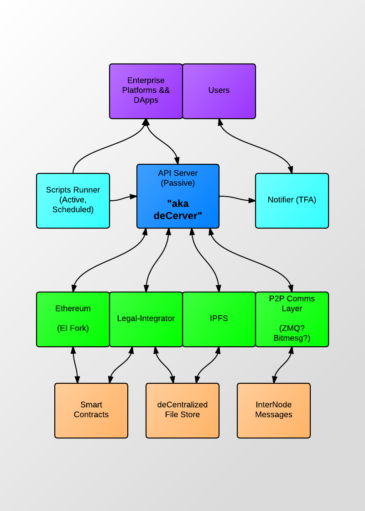

## The deCerver

This is the decerver repository.

**Note**: We are transitioning the Eris Stack to heavily utilize Docker, but this process is still a work in progress. For this reason, you need to either run an ipfs docker or just build the ipfs executable and run the daemon `ipfs daemon -writable` which will set up the web server.

## What is it?

It is beta software.

It is an application platform. It lets you load and run applications. We call them distributed applications because those are the types of applications we expect the decerver will mainly be used for. These applications consist of a UI (http/css/js), back-end javascript (this would be the server-side scripts in a normal web application), an optional smart contract back end, and some application meta data such as package and configuration files.

It is node.js but in Go. The way you call decerver methods in your (distributed) application code is through special back-end javascript. Decerver exposes some basic functionality, such as networking, event-processing, big integer math, logging, and other things. It also exposes the API methods of its modules, because:

It is a module platform, such as for example the Netbeans platform. It allows you to make a program or library into a module that can be utilized by the applications that are run. In order to make something into a module you need to do two things:

1) You must give the library a module wrapper. The module interface requires a number of functions, such as Start, Init, Subscribe (for events), and Shutdown, and those should be bound to library functions or complemented in the module wrapper code if such functionality does not exist. If 'Start' does not make sense for a certain lib, then the wrappers Start method should do nothing, but it would still have to be included.

2) You must give the library a javascript API. The way we do it in our modules is by simply calling the corresponding api method, and then convert the return value into a proper javascript object using some utility functions that are included with the decerver. It is very simple.

In the decerver-modules repository, you can see how our modules are built. Legal markdown is by far the simplest one, and only has the basic module wrapper + a single API method. The others are more complex.

Currently, modules has to be compiled together with the decerver in order to be used, which makes it look as if  Thelonious, IFPS and the other modules we've included are part of decerver itself, but they are not. IPFS, for example, is a stand alone library. We just put a module wrapper on it and gave it a javascript API. It has the same module wrapper as all the other modules we use. Decerver and dapp programmers could do this with any library they want, however, we currently do not support dynamic module loading. Once we get dynamic module loading in place (https://github.com/eris-ltd/decerver/issues/86), it will be possible to just switch modules during runtime, depending on what the currently loaded application needs. I would not recommend getting too deep into module development at this point, since the module API is going to change. Right now it's about application and not module making.

## What is it not?

It is not a blockchain. It does not have a blockchain do any of its work. Decerver itself runs perfectly fine without a blockchain present. It is however possible to use external libraries as modules, such as ethereum or thelonious, and those utilize blockchains as part of their functionality. These modules can then be used by the DApps that are run through the decerver.

It is not a key manager. Decerver does not store keys, it does not create them, and it does not sign any messages. If a module uses cryptographic keys, then it is also managing those keys. Central key management will be added to decerver, but only in the form of utility functions. The actual management itself will still be done externally.

It is not a program that is in competition with Ethereum. It is a complement. Bla bla bla. Imo the Eris ecosystem has its place in any distributed application stack. It is legitimate software that solves a lot of problems us early dapp makers faced, and it does it in a good way. We shouldn't have to apologize for it. This stuff needs and deserves to be around. If it happens to be in competition with other systems out there then too bad (for them mostly).

## Overview of the decerver

In the image shown above the deCerver package is in Blue. It acts as the hub for the system. Our distributed application template has four parts:

1) The UI. It is normally a webpage, but could be other things too, such as a simple cli. It communicates with decerver via http (RESTful, normally) or websockets.

2) Back-end javascript, which is interpreted by decerver. It would be server-side script in a normal system. It normally runs locally. No other users needs to be affected by the script that runs in someones decerver. Only when that script makes calls to the distributed logic/data modules will it be picked up by others.

3) Smart contracts. A system of smart contracts can be used to distribute logic and data between the different users, or nodes. This is what makes the applications decentralized. This is what's different from the regular client-server model.

4) Package and config files.

The systems at the bottom represents various different modules that can be added to decerver, such as smart contract enabled blockchain clients.

## An example decerver application

Let us look at a simple example: the [hello world dapp](https://github.com/eris-ltd/hello-world-dapp). The logic is deceptively simple: it has two functions. You can add files, and you can get the files that are added. Adding a file means adding that file to IPFS. That is what the back end script does when you order it to store a file - it calls on the IPFS module to store it. IPFS is a peer-to-peer, versioned file storage system. It works in a way similar to bittorrent (but also has git-like qualities and lots of other stuff that we don't make use of here). Every person that launches the hello world dapp is automatically hooked up to the IPFS dht, and is able to fetch files that other users add. Again, think bittorrent. If you host a file with bittorrent, other people can search for and get that file if they know the bittorrent hash. IPFS has hashes too. So how do you find the files? You need to know their hashes?

No. There is a smart contract on the thelonious blockchain that comes with the dapp. It takes file names and IPFS hashes and store them in a smart contract on the blockchain. Just like IPFS, the blockchain is distributed among all the nodes, although it uses a different system and runs on a different port. IPFS and thelonious are actually not aware of each other. Decerver, on the other hand, knows about both, and can communicate with both, which is how inter-op is made possible. That's pretty much what decerver is - a glue for all these different technologies that will make distributed application making easier.

This is what happens when a user adds a file from the hello world dapp UI:

- User sends a filename and the bytes of that file from the UI to the decerver via a http request.
- The decervers web-server receives the request, and passes it into the javascript vm.
- The dapps back-end javascript includes handlers for receiving http requests. If the request is properly formed, it will call a function that takes the filename and data as parameters.
- The function starts by adding the file data to IPFS, using the bound IPFS API methods. The function it calls will return the hash of the file if it was successfully added to the IPFS database.
- Next it will take the hash, and the filename, and write those into the smart contract that is deployed on the hello world dapp blockchain. This is done by sending a transaction to thelonious. The posting will be a key-value pair, where the filename is the key, and the hash is the value.
- As soon as the transaction has been committed, and the mined block has propagated to all the nodes, the key-value pair will be accessible to everyone.

This is how getting a file works, step by step:

- User sends a filename from the UI to the decerver. The request works the same way as when adding files.
- If the request is properly formed, a javascript function will be called to get the file. it takes the filename as parameter, and returns the contents of that file as a string.
- The function starts by querying the storage of the hello world dapp contract. If it finds an entry there with "filename" as key, it will get the hash associated with that key.
- Next it will get the file from IPFS by passing the file hash to it. That is how files are gotten. The ipfs method will return the contents of that file. It might fail, however, because the user could be disconnected from IPFS, or maybe the poster just added the file and then logged off meaning noone is hosting it, but that's to be expected (same thing with the blockchain). Under normal circumstances, though, both the file and the blockchain will be available.
- Finally, it passes the file contents back to the user, in the response to the request.

This is a very simple dapp, but what it does is quite revolutionary. It uses the combination of a distributed filestore and a smart contract enabled blockchain to distribute files without the need for a server. The next hello world dapp in the series (hello world 3) will have listing capacities as well, making it possible not only to get files by name, but also to list all the available files in the UI, along with the address of the poster and some other data. Add the options to remove and modify files, and some permissions and user management, and you got yourself a distributed dropbox type system. In fact, this is exactly what hello world dapp 4 will be. The only reason hello world 1 does not have this is because it's the first tutorial application so we want to keep it as simple as possible.
